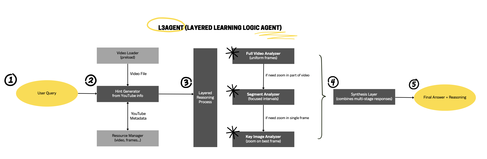

# L3Agent (Layered Learning Logic Agent)

## Overview
L3Agent (Layered Learning Logic Agent) is a hierarchical video question-answering system designed to mimic human-like visual reasoning. Instead of treating video as a static block of frames or relying solely on clip-based summaries, L3Agent adopts a layered analysis flow that iteratively refines its understanding across multiple levels of granularity.

As of 2025 April 25, it achieves 37.87% accuracy and 6.7% robustness. We have included our submitted result in submission folder, along with the logs of runs producing the result, and a script for (attempting) recovering answer from the logs. The average time needed per question is about 20 seconds.

By structuring the reasoning path from global to local context, L3Agent offers a scalable and interpretable solution for complex video understanding tasks in real-world applications.

## Workflow

The L3Agent follows a 4-step process after:

1. **User Query** - The process begins with preparing the resource for answering a new question(e.g. load video, clean old context etc).
2. **Hint Generator** - The system attempt to obtain YouTube video information, and ask model the organise the information and generate probing questions.
3. **Layered Reasoning Process**:
   - **Full Video Analyzer** - 
The methodology begins with a coarse full-video sweep, where the agent uses vision-language models (e.g., GPT-4O-mini) to form a high-level understanding and identify potentially relevant time intervals. 
   - **Segment Analyzer** - Based on demand, it may then performs focused segment analysis, zooming into these selected portions to capture finer contextual cues, interactions, or visual changes.
   - **Key Image Analyzer** - Finally, for pinpointing crucial visual evidence, L3Agent may dynamically selects a key representative frame to perform frame-level analysis.
4. **Synthesis and Delivery** - Combines the multi-stage responses from all analyzers.

## Getting Started
1. Clone the repository:
   ```bash
   git clone -b cleaned https://github.com/yiwen101/AIchem1st.git
   ```
2. Install dependencies and activate the environment:
   ```bash
   pip install -r "requirements.txt"
   ```
3. Provide your OpenAI API key:
   Create ".env" file in format of ".env.example". 
   You could leave the DEEPSEEK_API_KEY blank as latest L3 agent implementation does not make use of it. 
   However, please provide the OPENAI_API_KEY.
4. Move the video resource of the dataset into `videos/` folder:
5. Run the agent (single-question):
   ```bash
   python main.py run-l3-single <questions>.parquet <question_id>
   # E.g.
   python main.py run-l3-single test-00000-of-00001.parquet 0008-0
   ```
   Answer will be found in the console output.
6. Run the agent (all questions):
   ```bash
   python main.py run-l3 <questions>.parquet
   # E.g.
   python main.py run-l3 test-00000-of-00001.parquet
   ```
   Answers will be found in the `results/` folder.

## Dependencies
The system is built in Python using a lightweight dependency stack.

This multi-resolution pipeline is powered by OpenAI's multimodal APIs for image and video understanding, alongside segment extraction and frame sampling handled by OpenCV. 

Videos are sourced from Youtube in the standard dataset, and information (title, descriptions, transcript ...) are fetched using pytubefix and youtube-transcript-api.

### External Services
- **OpenAI API**: Vision + Chat endpoints (GPT-4O-mini, GPT-4, etc.) for image/video understanding and language synthesis
- **YouTube Data API**: Fetch video metadata and transcript.

### Assets (Models & Datasets)
- **Pre-trained Models**:
  - OpenAI's GPT-4O-mini (vision-enabled) for multimodal Q&A
- **Datasets & Videos**:
  - Local cached video files under `videos/` directory
  - Input questions downloaded from competition Hugging Face

### Other Library
- **Open CV**: video loading and frame extraction.
